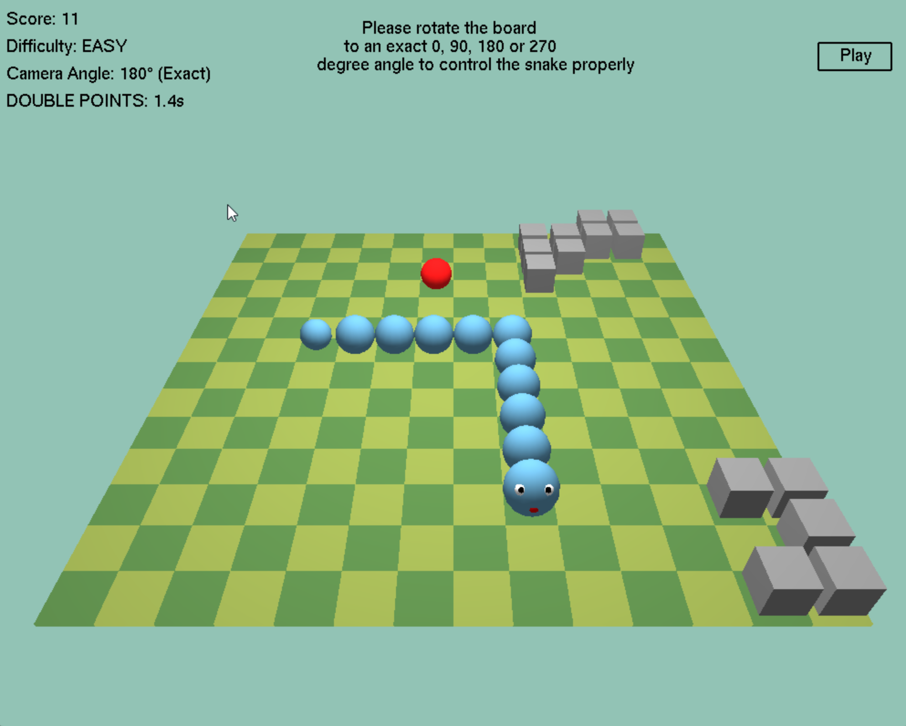
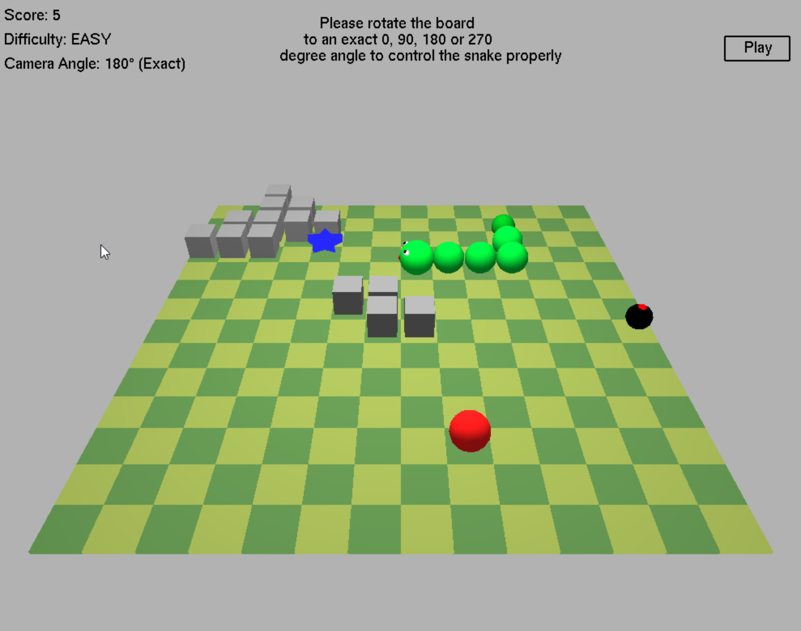
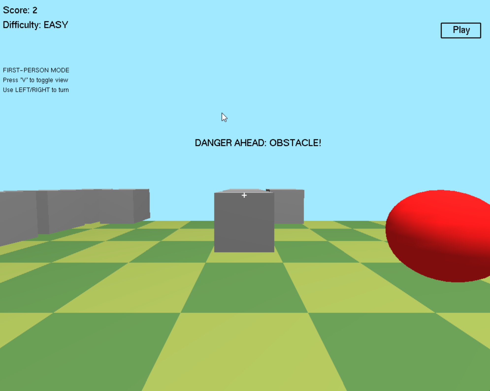
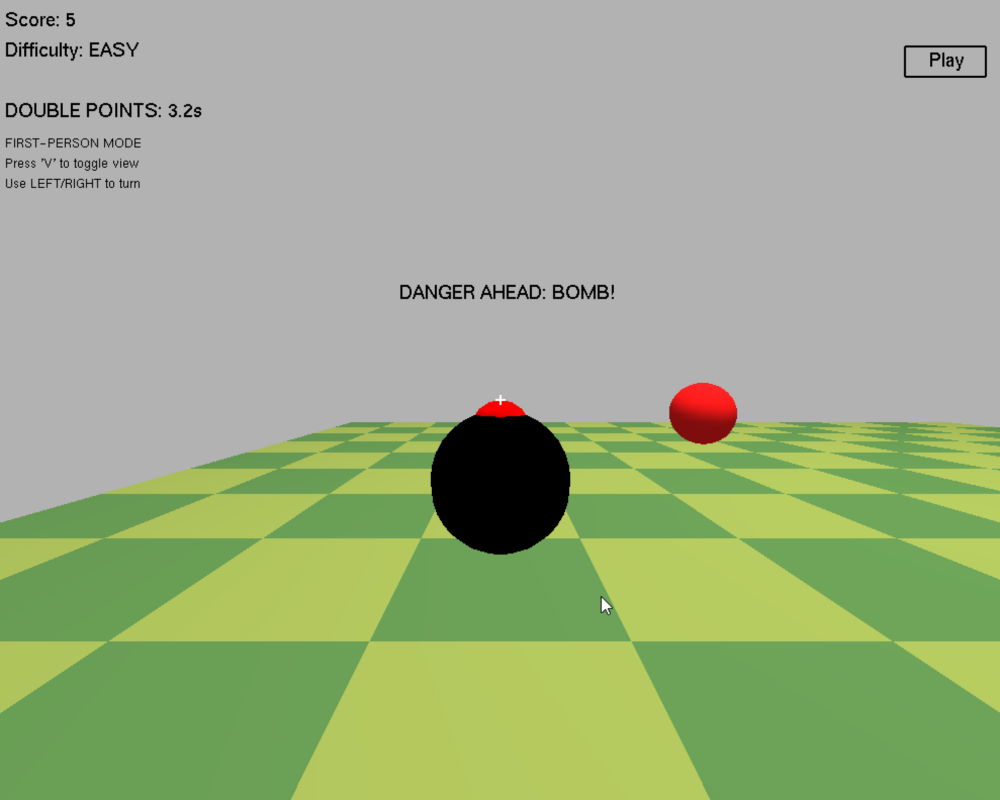
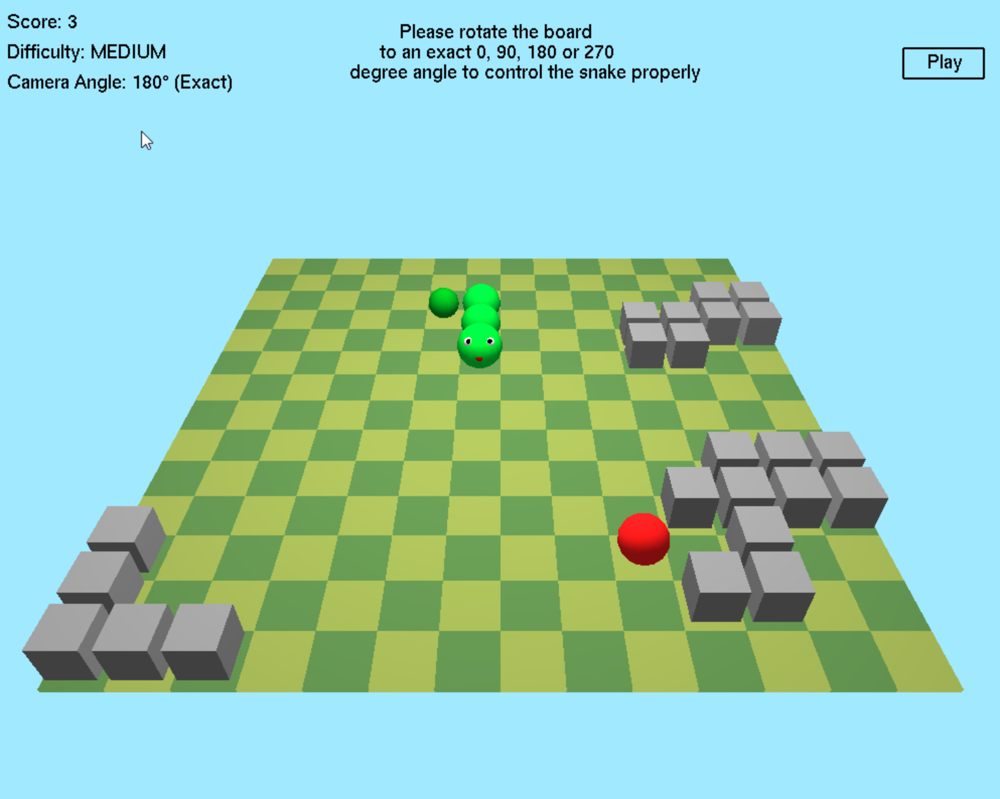
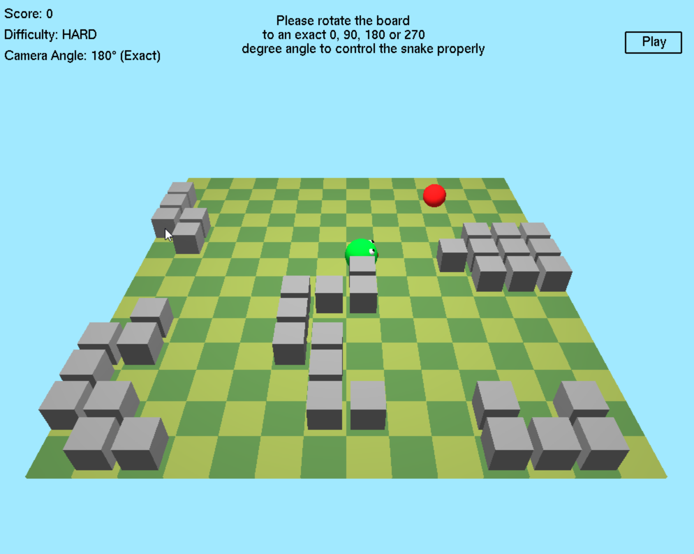

# 🐍 3D Snake Game

A modern take on the classic Snake game - reimagined in 3D using Python and OpenGL. This game includes immersive visuals, multiple camera modes (including first-person), dynamic difficulty settings, obstacles, bombs, and special effects, all packed into a single Python file.

---

## 🎯 Features

* **3D-style gameplay** using OpenGL (with lighting, shadows, and depth)
* **First-person and third-person camera views**
* **Difficulty selection**: Easy, Medium, Hard
* **Dynamic elements**: food, bombs, special power-ups, and obstacles
* **Responsive UI**: on-screen buttons for Play/Pause and mode selection
* **Visual effects**: glowing special food, rotating camera, grid coloring

---

## 🖥️ Technologies Used

* Python 3
* PyOpenGL
* GLUT (OpenGL Utility Toolkit)
* OpenGL Shading and Rendering

---

## 🕹️ Controls

| Action                   | Key(s)         |
| ------------------------ | -------------- |
| Move Snake               | Arrow keys     |
| Pause/Resume             | `P` or `Space` |
| Restart Game             | `R`            |
| Toggle First-Person View | `V`            |
| Zoom In/Out (3rd person) | `X` / `Y`      |
| Adjust Camera Height     | `W` / `S`      |
| Rotate Camera            | `A` / `D`      |
| Quit Game                | `Esc`          |

> **Note**: In First-Person mode, only LEFT and RIGHT turn the snake relative to its current direction.

---

## 🧠 Game Mechanics

### 🍎 Food & Growth

* Regular food increases your length and score.
* Every 5th food spawns a **special food** (a glowing blue star).
* Eating special food activates **Double Points** and **Speed Boost** temporarily.

### 💥 Bombs & Obstacles

* Bombs are introduced over time and vary by difficulty.
* Running into a bomb or an obstacle ends the game.
* New obstacles appear as your score increases, keeping gameplay challenging.

### 👁️ Camera Modes

* **Third-Person View**: Rotate and zoom to see the board from above.
* **First-Person View**: Navigate the board from the snake’s eyes, with warnings for nearby threats.

---

## 📐 Code Design

The game is structured around:

* **Modular functions**: for drawing grid, food, snake, and UI
* **State management**: including pause, play, game over, and first-person toggle
* **Real-time rendering**: using OpenGL’s double buffering and lighting
* **Event-driven input handling**: keyboard and mouse events drive gameplay

The game loop is tied to GLUT's `idle` function, which handles:

* Snake movement timing
* Bomb spawning logic
* Special effects duration

---

## 🧩 Known Limitations

* Snake direction is dependent on camera angle — ensure it's aligned to 0°, 90°, 180°, or 270° for accurate movement.
* Performance may vary depending on GPU and OpenGL support.

---

## 📚 Learning Opportunities

This project is ideal if you're looking to:

* Understand OpenGL in Python
* Explore game development logic (movement, collision, scoring)
* Implement UI and input systems
* Learn 3D transformations and camera perspectives

---

## 📸 Screenshots

---

## 👥 Contributors

- **B M Rauf**
- **Shahed Ahmed**
- **Sadman Sakib**

---
